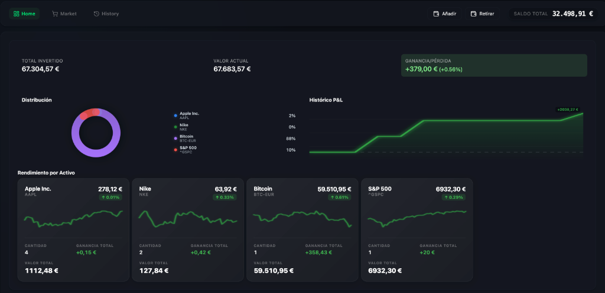

# 📈 Invest App: Financial Simulator



High-performance investment simulator optimized with **React 19**, **React Server Components (RSC)**, and **Waku**.


🔗 **Live Demo**: [invest-simulator-rho.vercel.app](https://invest-simulator-rho.vercel.app)

## 🚀 Key Features

- **Streaming SSR & RSC**: Leverages React 19 streaming to render the UI shell instantly. Critical data (Portfolio, Quotes) is fetched in parallel server-side and streamed to the client, while **Skeletons** provide immediate visual feedback for slower connections.
- **Performance Optimized**: Advanced parallel data fetching (quotes + portfolio + history) reducing initial render and tab transition times.
- **React Compiler**: Natively integrated for automatic re-render optimizations and memoization.
- **Server Actions**: Business logic (trading, balance) executed entirely on the server via **Waku**, returning streams that progressively update the UI without full page reloads.
- **Flicker-free SSR Visualizations**: Interactive charts pre-rendered on the server for a smooth experience from the first frame.
- **Cloud-Ready Persistence**: **Turso (LibSQL)** database with **Drizzle ORM**, featuring optimized initialization and connection caching.

## 🛠️ Tech Stack

- **React 19**: Using `useActionState`, `useOptimistic`, `use()`, and Server Components.
- **React Compiler**: Automatic component optimization.
- **Waku**: Minimalist framework for RSC and native Streaming SSR.
- **Drizzle ORM & @libsql/client/web**: Type-safe DB management with cross-platform web client.
- **Turso**: Distributed SQLite database.
- **Yahoo Finance**: Data source with an optimized *mandatory delay* system to ensure speed and avoid 429 errors.
- **Lucide React**: Optimized financial iconography.

## 🗄️ Dual Persistence System

The application uses an intelligent system that automatically switches between two types of **LibSQL** databases:

1.  **Local (Development)**: Uses a local SQLite file (`invest.db`). Perfect for rapid development without external dependencies. Created automatically on startup.
2.  **Vercel / Cloud (Turso)**: Since Vercel lacks persistent disk, it connects to **Turso** in production. The app detects environment variables and switches to the compatible web client transparently.

### Vercel Configuration
To run in the cloud, add these variables in your Vercel panel:
- `DATABASE_URL`: Your Turso endpoint (`libsql://...`)
- `DATABASE_AUTH_TOKEN`: Your access token.

## 📂 Project Structure

```text
src/
├── components/     # UI Components (Layout, Modals, Shared)
├── data/           # Asset configuration and seeds
├── db/             # Schema and Database connection (SQLite/Drizzle)
├── hooks/          # Synchronization hooks (Optimistic UI)
├── models/         # Financial data interfaces
├── pages/          # File-based routing (Waku)
├── server-actions/ # Business logic and DB mutations
└── utils/          # Formatters and utilities
```

## 📋 Data Model (Interfaces)

| Interface | Description |
|-----------|-------------|
| `IAsset` | Representation of a financial asset and its history. |
| `ITransaction` | Full audit trail of movements (buy, sell, deposits). |
| `IPortfolio` | Consolidated portfolio state and balance. |
| `ITrade` | Parameters for executing market orders. |

## 📦 Installation and Usage

```bash
# Install dependencies
npm install

# Development mode (Port 3005)
# Generates invest.db automatically if it doesn't exist
npm run dev

# Production
npm run build && npm run start
```

### Launcher Scripts
- `launch-dev.sh`: Script for Linux (Chrome App Mode + Auto-install).
- `launch-dev.bat`: Script for Windows (CMD + Auto-install).

## ⚠️ Legal Note
This project is an **educational simulator**. It uses virtual money and real market data for informational purposes only. Trades do not have any impact on real financial markets.

---

Built with ❤️ using **Waku** and **React 19** 🚀
